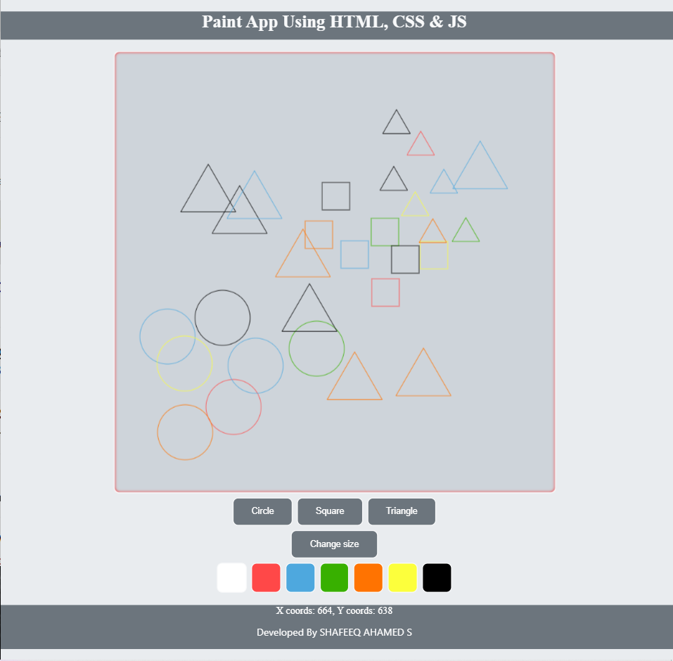
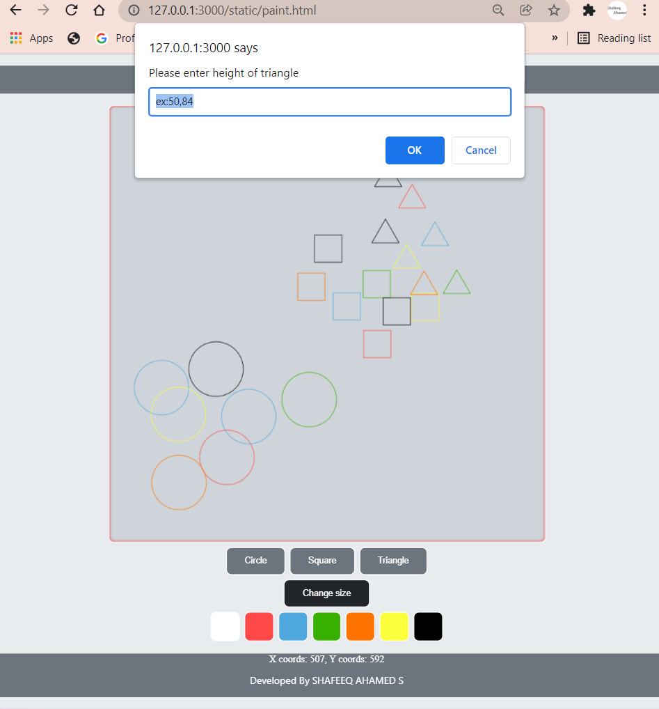

# Web Page for Paint Application

## AIM:

To design a static website for Paint Application using HTML5 canvas.

## DESIGN STEPS:

### Step 1:

Requirement collection.

### Step 2:

Creating the layout using HTML,CSS and canvas.

### Step 3:

Write javascript to capture move events.

### Step 4:

Perform the drawing operation based on the user input.

### Step 5:

Validate the layout in various browsers.

### Step 6:

Validate the HTML code.

### Step 6:

Publish the website in the given URL.

## PROGRAM :

### HTML CODE:
```
<!DOCTYPE html>
<html lang="en">
    <head>
        <meta charset="UTF-8">
        <meta http-equiv="X-UA-Compatible" content="IE=edge">
        <meta name="viewport" content="width=device-width, initial-scale=1.0">
        <title>Paint app</title>
        <link rel="stylesheet" href="css/style.css">
    </head>
    <body id="body">
        <h1>Paint App Using HTML, CSS & JS</h1>
        <div id="canvasposition">
            <canvas id="myCanvas" width="800" height="800" onclick="showCoords(event)"></canvas>
        </div>
        
        <button onclick="shape=1" id="shapeandsize">Circle</button>
        <button onclick="shape=2" id="shapeandsize">Square</button>
        <button onclick="shape=3" id="shapeandsize">Triangle</button>
        <br>
        <button onclick="size()" id="shapeandsize" >Change size</button></center>

        <button onclick="change_color(this)" id="colorbox" style="background: white;"></button>
        <button onclick="change_color(this)" id="colorbox" style="background: rgb(255, 72, 72);"></button>
        <button onclick="change_color(this)" id="colorbox" style="background: #4ea8de;"></button>
        <button onclick="change_color(this)" id="colorbox" style="background: #38b000;"></button>
        <button onclick="change_color(this)" id="colorbox" style="background: rgb(255, 115, 1);"></button>
        <button onclick="change_color(this)" id="colorbox" style="background: rgb(252, 255, 60);"></button>
        <button onclick="change_color(this)" id="colorbox" style="background: rgb(0, 0, 0);"></button>

        <div id="footer">
            <p>Developed By SHAFEEQ AHAMED S</p>
        </div>
        
        <script src="js/script.js"></script>
    </body>
</html>
```    

### CSS CODE:
```
#canvasposition{
    text-align: center;
   
}

#myCanvas{
    background-color: #ced4da; 
    box-shadow: inset 0 0 5px red;
    backdrop-filter: blur(15px);
    border-radius: 10px;
    border: 1px solid #ffffff;
}
#shapeandsize{
    background-color: #6c757d;
    border: 2px solid #f8f9fa;
    border-radius: 10px;
    color: white;
    padding: 15px 32px;
    text-align: center;
    display: inline-block;
    font-size: 16px;
    margin: 4px 2px;
    cursor: pointer;
}
#shapeandsize:hover{
    background-color:#212529;
    transition: 0.3s;
}
#body{
    background-color: #e9ecef;
}
#colorbox{
    border: 2px solid #f8f9fa;
    border-radius: 10px;
    padding: 25px 25px;
    text-align: center;
    display: inline-block;
    font-size: 16px;
    margin: 4px 2px;
    cursor: pointer;
}
#colorbox:hover{
    border: 1px #212529;
    box-shadow: 5px 5px #212529;
    transition: 0.5s;
}
h1{
    height: 50px;
    color: #f8f9fa;
    text-align: center;
    background-color: #6c757d;
}
#footer{
    color: white;
    font-family: 'Segoe UI', 'Open Sans', 'Helvetica Neue', sans-serif;
    height: 80px;
    top: 20px;
    text-align: center;
    background-color: #6c757d;
    font-size: large;
}
```

### JS CODE:
```
const canvas = document.getElementById("myCanvas");
const ctx = canvas.getContext("2d");
ctx.fillStyle = "#FF0000";
canvas.height = canvas.width;
ctx.transform(1, 0, 0, -1, 0, canvas.height);
let xMax = canvas.height;
let yMax = canvas.width;
let csize= 50;
let sqsize= 50;
let tsize=50;
let tatakae="black";
function size()
{   
if (shape==1){
    let c= prompt("Please enter radius of circle", "ex:100,50");
    csize=c;
} 
if (shape==2){
    let s = prompt("Please enter height of square", "ex:100,20");
    sqsize=s;
}
if (shape==3){
    let t= prompt("Please enter height of triangle","ex:50,84");
    tsize=t;
}
}
function change_color(element){
    tatakae=element.style.background;
}

    function showCoords(event)

    {
    var x = event.clientX-368;
    var y = yMax-event.clientY+93;
    var coords = "X coords: " + x + ", Y coords: " + y;
    document.getElementById("demo").innerHTML = coords;
    
        if (shape==1){
            ctx.beginPath();
            ctx.arc(x, y, csize, 0, 2 * Math.PI);
            ctx.strokeStyle=tatakae;
            ctx.stroke();
        }

        if (shape==2){
            ctx.beginPath();
            ctx.rect(x-(sqsize/2),y-(sqsize/2), sqsize,sqsize);
            ctx.strokeStyle=tatakae;
            ctx.stroke();
        }
        if (shape==3){
            ctx.beginPath();
            ctx.moveTo(x, y);
            ctx.lineTo(x-(tsize/2),y-(tsize*0.86602));
            ctx.lineTo(x+(tsize/2),y-(tsize*0.86602));
            ctx.lineTo(x,y)
            ctx.strokeStyle=tatakae
            ctx.stroke();
        }

    }

```

## OUTPUT:




## Result:

Thus a website is designed and validated for paint application using HTML5 canvas.
